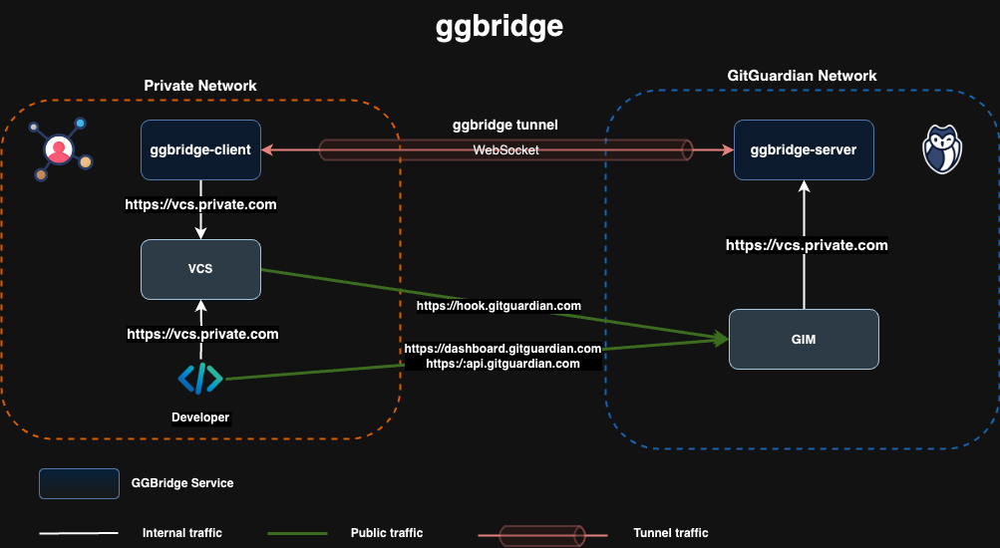

# ggbridge: connect your on-prem VCS with the GitGuardian Platform

**ggbridge** is a tool designed to facilitate secure connections between the GitGuardian SaaS platform and your on-premise Version Control Systems (VCS) that are not exposed to the public internet. By acting as a secure bridge, GGBridge enables GitGuardian to access repositories located in isolated environments, ensuring that your sensitive code data remains protected while taking advantage of GitGuardian’s powerful scanning capabilities.

With ggbirdge, organizations can maintain their internal infrastructure and security protocols without sacrificing the ability to integrate with GitGuardian’s monitoring and alerting features.

## How it Works



**ggbridge** is composed of two main parts:

- **Server**: Installed on the GitGuardian's network.
- **Client**: Installed on the customer’s private network.

The client component connects to the server using the WebSocket protocol to establish a secure, mutually authenticated (mTLS) tunnel between the customer’s network and the GitGuardian SaaS platform. This ensures both ends are securely authenticated.

Once the tunnel is established, a proxy server is deployed on the GitGuardian side, which allows secure access to the client’s on-prem VCS through the tunnel. This proxy connection enables GitGuardian to scan and monitor your repositories without requiring your VCS to be publicly accessible.

## Install and configure

**ggbridge** is distributed as a Distroless Docker image based on Wolfi OS, ensuring minimal dependencies and enhanced security.
Additionaly, a **debug** variant of the Docker image is available, this version includes additional tools and allows you to connect to the container via a shell, facilitating troubleshooting and debugging during development or integration.

The project offers two deployment methods:

- **Docker Deployment**: Ideal for local testing or simpler use cases.
- **Helm Chart Deployment**: The preferred method for production environments, offering enhanced configurability and scalability for Kubernetes setups.

### Docker deployment

Here is an example of a client deployment using Docker Compose with mTLS enabled:

```yaml
name: ggbridge

services:
  client:
    image: gitguardian/ggbridge:unstable-debug
    entrypoint:
      - ggbridge
    command:
      - client
    environment:
      SERVER_ADDRESS: subdomain.domain.com
      TLS_ENABLED: "true"
      LOG_LEVEL: INFO
    volumes:
      - ./certs/client.crt:/certs/client.crt:ro
      - ./certs/client.key:/certs/client.key:ro
    restart: on-failure
```

### Helm deployment

Here is an example of a Helm values file to deploy the ggbridge client:

```yaml
mode: client
subdomain: my-subdomain

tls:
  enabled: true
  existingSecret: ggbridge-client-crt
  existingSecretKeys:
    crt: tls.crt
    key: tls.key
```

Run the following `helm` command passing you custom values file as a parameter:

```shell
helm -n ggbridge upgrade --install --create-namespace \
  ggbridge oci://ghcr.io/gitguardian/ggbridge/helm/ggbridge \
  -f values.yaml
```
