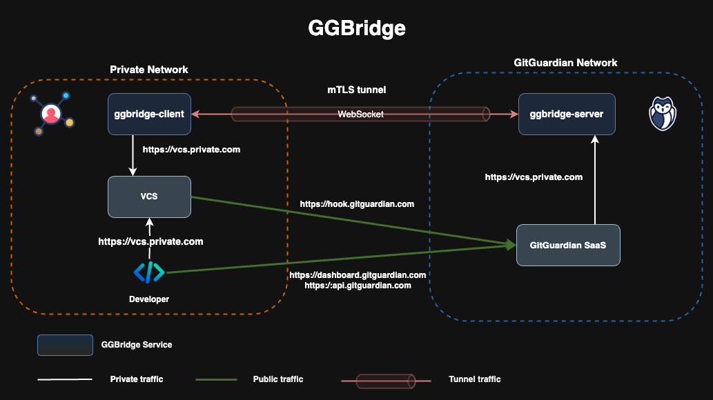

# ggbridge: connect your self-hosted services with the GitGuardian Platform

**ggbridge** is a tool designed to facilitate secure connections between the GitGuardian SaaS platform and your self-hosted services (e.g., Version Control Systems or Secrets Managers) that are not exposed to the public internet. By acting as a secure bridge, ggbridge enables GitGuardian to access repositories located in isolated environments, ensuring that your sensitive code data remains protected while taking advantage of GitGuardian's powerful scanning capabilities.

With ggbridge, organizations can maintain their internal infrastructure and security protocols without sacrificing the ability to integrate with GitGuardian's monitoring and alerting features.

## How it Works



**ggbridge** is composed of two main parts:

- **Server**: Installed on the GitGuardian's network.
- **Client**: Installed on the customer's private network.

The client component connects to the server using the WebSocket protocol to establish a secure, mutually authenticated (mTLS) tunnel between the customer's network and the GitGuardian SaaS platform. This ensures both ends are securely authenticated.

Once the tunnel is established, a proxy server is deployed on the GitGuardian side, which allows secure access to the client's self-hosted services through the tunnel. This proxy connection enables GitGuardian to scan and monitor your repositories without requiring your VCS to be publicly accessible.

## Install and configure

For GGBridge configuration instructions, please refer to our public documentation:
- https://docs.gitguardian.com/platform/enterprise-administration/ggbridge

**ggbridge** is distributed as a Distroless Docker image based on Wolfi OS, ensuring minimal dependencies and enhanced security.
Additionaly, a **shell** variant of the Docker image is available, this version includes additional tools and allows you to connect to the container via a shell, facilitating troubleshooting and debugging during development or integration.

The project offers two deployment methods:

- **Docker Deployment**: Ideal for local testing or simpler use cases.
- **Helm Chart Deployment**: The preferred method for production environments, offering enhanced configurability and scalability for Kubernetes setups.

### Docker deployment

Deploy the ggbridge client via Docker Compose by performing the following actions:

- Create `docker-compose.yml` file

```yaml
name: ggbridge

services:
  client:
    image: gitguardian/ggbridge:latest-shell
    environment:
      SERVER_ADDRESS: <my-subdomain>.ggbridge.gitguardian.com
      TLS_ENABLED: 'true'
    volumes:
      - ./tls/ca.crt:/etc/ggbridge/tls/ca.crt:ro
      - ./tls/tls.crt:/etc/ggbridge/tls/client.crt:ro
      - ./tls/tls.key:/etc/ggbridge/tls/client.key:ro
      - ./docker/nginx/nginx.local.conf:/etc/ggbridge/nginx.conf
    restart: on-failure
```

- Run `docker-compose`

```shell
docker compose up
```

### Helm deployment

To deploy the ggbridge client in your Kubernetes cluster using Helm, follow these steps:

1. Requirements

Before deploying, make sure you have:

- The hostname of your bridge server (available from the GitGuardian dashboard).
- The certificate bundle archive, which includes the client certificate and CA required to establish the mTLS connection.

2. Create the ggbridge namespace

```shell
kubectl create namespace ggbridge
```

1. Create the client certificate secret

Extract the certificate bundle downloaded from the GitGuardian dashboard and create a Kubernetes secret with the certificate files:

```shell
kubectl -n ggbridge create secret generic ggbridge-client-crt \
  --from-file=tls.crt \
  --from-file=tls.key \
  --from-file=ca.crt
```

4. Configure your Helm values.yaml

Edit your Helm values file to point to your bridge server and the secret created above:

```yaml
hostname: <my-subdomain>.ggbridge.gitguardian.com

tls:
  enabled: true
  existingSecret: ggbridge-client-crt
  existingSecretKeys:
    caCrt: ca.crt
    crt: tls.crt
    key: tls.key
```

For **OpenShift** deployment, use the following values:

```yaml
hostname: <my-subdomain>.ggbridge.gitguardian.com

tls:
  enabled: true
  existingSecret: ggbridge-client-crt
  existingSecretKeys:
    caCrt: ca.crt
    crt: tls.crt
    key: tls.key

podSecurityContext:
  enabled: false

containerSecurityContext:
  enabled: false

proxy:
  # DNS used to resolve GitGuardian domain names (e.g.: hook.gitguardian.com)
  resolver: dns-default.openshift-dns.svc.cluster.local
```

5. Deploy with Helm

Run the Helm installation command:

```shell
helm -n ggbridge upgrade --install --create-namespace \
  ggbridge oci://ghcr.io/gitguardian/ggbridge/helm/ggbridge \
  -f values.yaml
```

## Examples

Here, you will find various usage examples of ggbridge, each example provides a step-by-step guide on how to configure and use ggbridge to establish a secure, authenticated connection between your self-hosted services and the GitGuardian platform.

| Name                                          | Description                                   |
| --------------------------------------------- | --------------------------------------------- |
| [2-way-tunneling](./examples/2-way-tunneling) | Enable client-to-server tunnels               |
| [ggscout](./examples/ggscout)                 | Connect ggscout with the GitGuardian platform |
