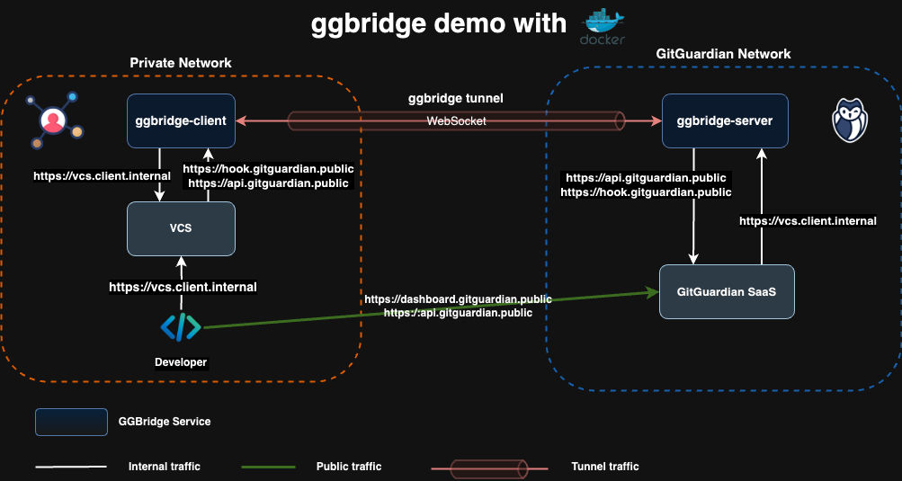

# ggbridge demo



Here is a demo built with [Docker Compose](https://docs.docker.com/compose/) to simulate the deployment of a **ggbridge** tunnel between a client’s network and the GitGuardian platform. The ggbridge proxy allows the GitGuardian platform to securely access the client’s Version Control Systems without requiring direct exposure of the client’s internal services to the internet.

By using this demo, you can observe how the **ggbridge** proxy facilitates secure access to VCS repositories, demonstrating its potential for managing secure connections in real-world scenarios. The demo includes all necessary components to simulate the client network and proxy behavior, offering an easy-to-use example for testing and learning.

## Requirements

To run this demo, you need to have the following installed on your host:

- [Docker](https://docs.docker.com/engine/install/)
- [Docker Compose](https://docs.docker.com/compose/install/) >= 2.26.0

Make sure both tools are installed and properly configured before proceeding with the demo setup.

## Run the demo

- Generate TLS certificates:

```shell
cd demo
./scripts/gen-certs.sh
```

- Start services using docker compose:

```shell
cd demo
docker compose up -d
```

- Check that the following containers are running

```shell
docker compose ps
```

expected output:

```shell
NAME                     IMAGE                                COMMAND                  SERVICE       CREATED         STATUS        PORTS
ggbridge-client-1        gitguardian/ggbridge:unstable-shell  "/usr/bin/ggbridge c…"   client        2 seconds ago   Up 1 second
ggbridge-developer-1     gitguardian/ggbridge:unstable-shell  "sleep infinity"         developer     2 seconds ago   Up 1 second
ggbridge-gitguardian-1   gitguardian/ggbridge:unstable-shell  "/usr/sbin/nginx -c …"   gitguardian   2 seconds ago   Up 1 second   10.19.85.1:80->80/tcp
ggbridge-server-1        gitguardian/ggbridge:unstable-shell  "/usr/bin/ggbridge s…"   server        2 seconds ago   Up 1 second
ggbridge-vcs-1           gitguardian/ggbridge:unstable-shell  "/usr/sbin/nginx -c …"   vcs           2 seconds ago   Up 1 second
```

- Try to make an HTTP request to the client’s VCS from GitGuardian

```shell
docker compose exec gitguardian \
  curl https://vcs.client.internal
```

expected output:

```shell
curl: (6) Could not resolve host: vcs.client.internal
```

We cannot reach the VCS from GitGuardian because they are on two separate networks.

- Now, Let's try making an HTTP request to the client’s VCS server from GitGuardian using the **ggbridge** proxy

```shell
docker compose exec gitguardian \
  curl --proxy socks5h://proxy.gitguardian.internal:9180 https://vcs.client.internal
```

Et voilà! The request is now routed through the **ggbirdge** proxy and the internal VCS DNS name is resolved by the proxy. You should have the following JSON response for the VCS server:

```json
{"message": "Welcome to the VCS server", "code": 200}
```

- Stop the demo

```shell
docker compose down
```
