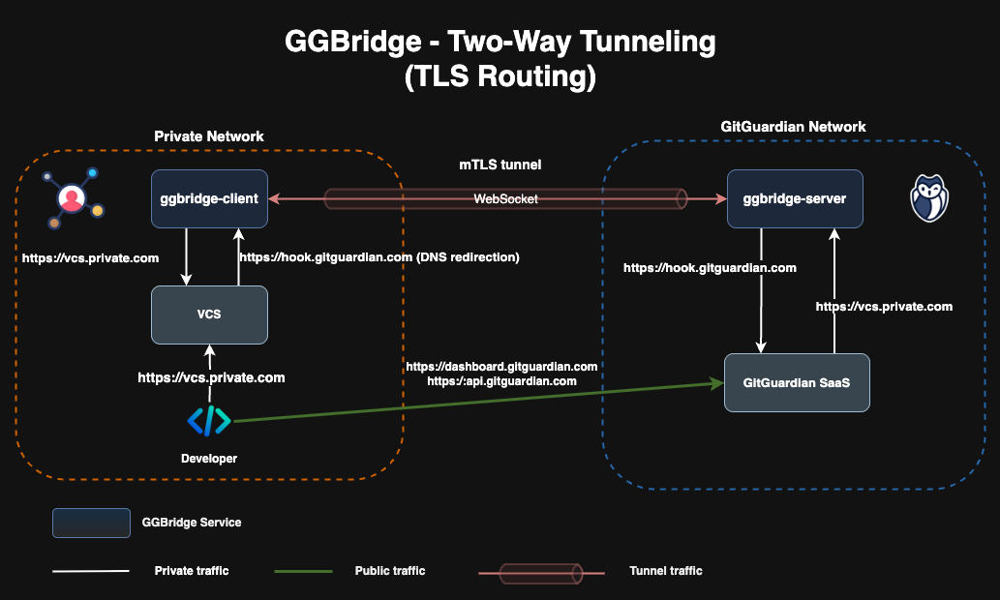
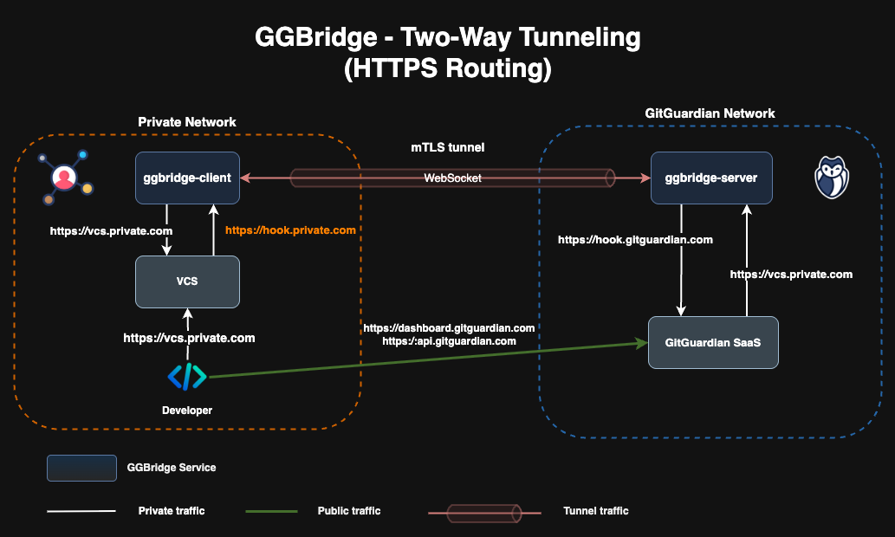

# Enabling 2-Way Tunneling

By default, the `ggbridge` client does not expose any **client → server** proxies that allow accessing remote resources through the established tunnel.

However, `ggbridge` supports two types of client-to-server proxies:

- **TLS Routing**: Exposes a TLS port to forward all incoming TLS traffic through a TCP tunnel. This requires DNS redirection, e.g., redirecting `hook.gitguardian.com` requests to the ggbridge client.
- **HTTPS Routing**: Exposes an HTTPS service and allows defining routing rules. For instance, you can expose a hostname like `hook.gitguardian.internal` and route traffic to `hook.gitguardian.com` through the ggbridge tunnel.

> **Note:** On the server side, only requests to `hook.gitguardian.com` and `api.gitguardian.com` are allowed for client → server traffic.

---

## TLS Routing



To enable **TLS Routing**, update your Helm values as follows:

```yaml
client:
  tunnels:
    tls:
      enabled: true
```

The TLS port can be exposed using one of the following methods:

1. LoadBalancer Service

Helm values file example 👉 [values-tls-service.yaml](./helm/values-tls-service.yaml)

```yaml
proxy:
  tunnels:
    tls:
      service:
        type: LoadBalancer
        ports:
          tls:
            # 443 is the default TLS port
            port: 443
```

2. Ingress

Helm values file example 👉 [values-tls-ingress.yaml](./helm/values-tls-ingress.yaml)

```yaml
proxy:
  tunnels:
    tls:
      ingress:
        enabled: true
        className: ""
```

3. Gateway API

Helm values file example 👉 [values-tls-gateway.yaml](./helm/values-tls-gateway.yaml)

```yaml
proxy:
  tunnels:
    tls:
      gateway:
        enabled: true
        # This will create the gateway resource, you can disable it if you want to mange it on you own.
        create: true
        className: ""
```

## HTTPS Routing



To enable HTTPS Routing, update your Helm values:

```yaml
client:
  tunnels:
    web:
      enabled: true
```

This service can be exposed via Ingress or Gateway:

1. Ingress

Helm values file example 👉 [values-https-ingress.yaml](./helm/values-https-ingress.yaml)

```yaml
proxy:
  tunnels:
    web:
      ingress:
        enabled: true
        # -- Set the ingress ClassName (leave empty to use default)
        className: ""
        listeners:
          # This listener exposes an HTTPS service with the hostname
          # `hook.private.com` and routes traffic to `hook.gitguardian.com`
          - hostname: hook.private.com
            backend: hook.gitguardian.com
            tls:
              # Certificate for hook.private.com
              secretName: internal-crt
```

2. Gateway API

Helm values file example 👉 [values-https-gateway.yaml](./helm/values-https-gateway.yaml)

```yaml
proxy:
  tunnels:
    web:
      gateway:
        enabled: true
        # -- Set the gateway ClassName (leave empty to use default)
        className: ""
        listeners:
          - hostname: hook.private.com
            backend: hook.gitguardian.com
            tls:
              # Certificate for hook.private.com
              secretName: internal-crt
```

With these configurations, your ggbridge client can securely forward traffic through the tunnel from the client side to approved GitGuardian services.
