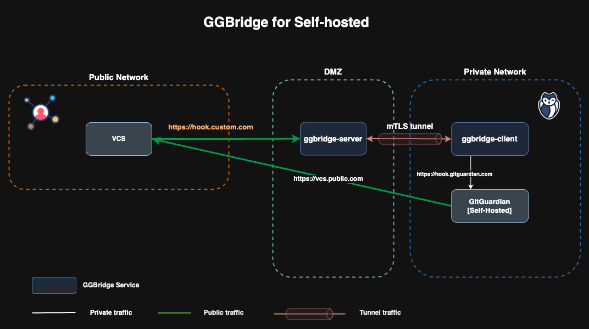

# GGBridge Use Cases

This page details the main use cases covered by **GGBridge**.

It provides an overview of the different scenarios in which GGBridge can be used, including how it facilitates secure and seamless connections between on-premises VCS and the GitGuardian platform. Each use case is documented with key considerations and implementation details to help users understand and deploy GGBridge effectively.

💡 Feel free to explore the different use cases and adapt the configurations to your needs, you can refer to the [Helm Chart documentation](../helm/ggbridge/README.md).

## Connect your VCS to your Self-Hosted instance

You have deployed a **Self-Hosted GitGuardian** instance on a network completely isolated from the internet, yet you still want it to access a public VCS and allow the VCS to communicate with your instance—for example, to enable real-time scanning.

### Architecture overview



### Deploy the GGBridge server

Configure the following values:

```yaml
hostname: <ggbridge-server-hostname>

tls:
  enabled: true
  existingSecret: ggbridge-server-crt
  existingSecretKeys:
    caCrt: ca.crt
    crt: tls.crt
    key: tls.key

server:
  # -- Expose the GGBridge Server endpoint using ingress
  ingress:
    enabled: true

proxy:
  tunnels:
    web:
      # -- Expose the web tunnel using ingress
      ingress:
        enabled: true
        listeners:
          # -- Configure a listener for hook.custom.com and rewrite-redirect to hook.gitguardian.com
          - hostname: hook.custom.com
            backend: hook.gitguardian.com
            tls:
              # -- Sepcify the TLS secret name containing the certificate for hook.custom.com
              secretName: g9n-crt
```

### Deploy the GGBridge client

Configure the following values:

```yaml
hostname: <ggbridge-server-hostname>

tls:
  enabled: true
  existingSecret: ggbridge-client-crt
  existingSecretKeys:
    caCrt: ca.crt
    crt: tls.crt
    key: tls.key

client:
  reverseTunnels:
    web:
        # -- Enable web reverse tunnel
      enabled: true
```
