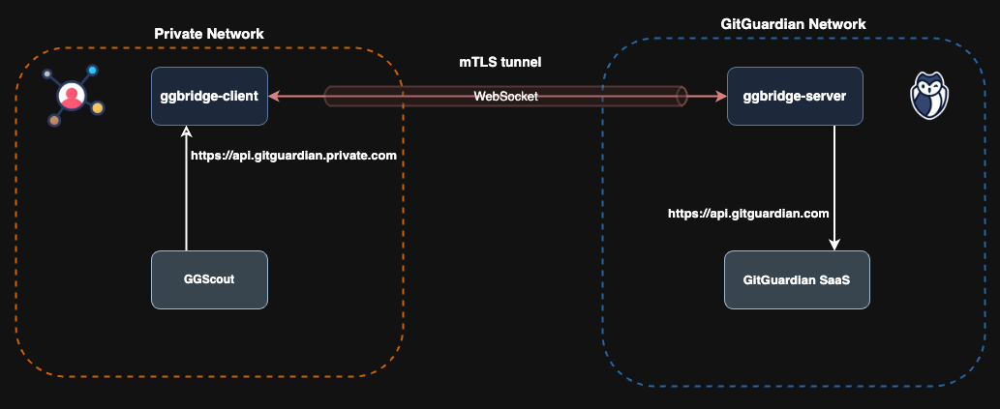

# Connect ggscout with the GitGuardian Platform

You want to deploy **[ggscout](https://docs.gitguardian.com/ggscout-docs/home)** in your Kubernetes cluster, but it doesn’t have access to the GitGuardian platform, preventing you from viewing the NHI inventory from the dashboard.

`ggbridge` can help you establish a secure and mTLS-authenticated gateway between your network and the GitGuardian platform, allowing ggscout to communicate with the GitGuardian public API, and thus, transmit the inventory.



As you can see in the diagram above, we configure the ggbridge client to expose an internal API endpoint dedicated to communicating with the GitGuardian API through ggbridge’s secure tunnel.

## Requirements

Before configuring the ggbridge client on you side, ensure that the GitGuardian team has created a dedicated ggbridge server for your organization.
You can manage and configure your ggbridge instance directly from the GitGuardian dashboard, where you will have access to its settings (hostname, certificates...) and operational status.

If you do not yet have a dedicated Bridge, please contact the GitGuardian support team to request its creation before proceeding with the deployment.

## Configuration

### ggbridge Client configuration

To enable the web tunnel and expose the GitGuardian API on your private internal network, you need to configure the ggbridge client.

Follow these steps to create a `values.yaml` file with the appropriate Helm values.

#### 1. Set the ggbridge Hostname

Configure the ggbridge client to connect to your hostname:

```yaml
hostname: <my-subdomain>.ggbridge.gitguardian.com

tls:
  enabled: true
  existingSecret: ggbridge-client-crt
  existingSecretKeys:
    caCrt: ca.crt
    crt: tls.crt
    key: tls.key
```

- `hostname`: The subdomain assigned to your ggbridge instance.
- `tls.enabled`: Enables TLS for secure communication.
- `tls.existingSecret`: References the Kubernetes secret storing your client certificates.
- `tls.existingSecretKeys`: Specifies the keys within the secret.

#### 2. Enable the Web Tunnel

The web tunnel allows HTTP traffic from the client to the server:

```yaml
client:
  tunnels:
    web:
      enabled: true
```

#### 3. Expose the GitGuardian API on Your Internal Network

There are multiple ways to expose the GitGuardian API within your network. You can use one of the following Kubernetes resources:

##### **Option 1: Service (In-Cluster Access Only)**

This option is only viable if the ggbridge client is deployed in the same Kubernetes cluster as **ggscout**. It enables internal communication using a Kubernetes service.

```yaml
proxy:
  tunnels:
    web:
      service:
        listeners:
          - name: <my-service-name>
            backend: api.gitguardian.com
```

The GitGuardian API will be accessible internally at:

```shell
http://<my-service-name>.<namespace>.svc.cluster.local
```

Helm values file example 👉 [values-service.yaml](./helm/values-service.yaml)

##### **Option 2: Ingress**

Expose the API externally using an Ingress resource:

```yaml
proxy:
  tunnels:
    web:
      ingress:
        enabled: true
        className: <my-ingress-className> # (Optional) Uses the default Ingress class if not set
        listeners:
          - hostname: api-gitguardian.<my-domain>
            backend: api.gitguardian.com
            tls:
              secretName: <my-tls-secret>
```

The GitGuardian API will be accessible at:

```shell
https://api-gitguardian.<my-domain>
```

Helm values file example 👉 [values-ingress.yaml](./helm/values-ingress.yaml)

##### **Option 3: Gateway API**

For environments using the **Gateway API**, you can configure it as follows:

```yaml
proxy:
  tunnels:
    web:
      gateway:
        enabled: true
        className: <my-gateway-className> # (Optional) Uses the default Gateway class if not set
        listeners:
          - hostname: api-gitguardian.<my-domain>
            backend: api.gitguardian.com
            tls:
              secretName: <my-tls-secret>
```

The GitGuardian API will be accessible at:

```shell
https://api-gitguardian.<my-domain>
```

Helm values file example 👉 [values-gateway.yaml](./helm/values-gateway.yaml)

#### 4. Deploy The ggbridge Client

Install/Upgrade the GGbridge client using Helm:

```shell
helm -n ggbridge upgrade --install --create-namespace \
  ggbridge oci://ghcr.io/gitguardian/ggbridge/helm/ggbridge \
  -f values.yaml
```

---

### ggscout Configuration

#### 1. Configure the Helm values

To enable **ggscout** to communicate with the GitGuardian API via the configured ggbridge client, update the `values.yaml` file with the internal API endpoint:

```yaml
inventory:
  config:
    gitguardian:
      endpoint: "<my-api-endpoint>"
      api_token: <my-api-token>
```

- `endpoint`: The internal URL of the GitGuardian API.
- `api_token`: The authentication token for API access.

Refer to the [ggscout GitHub project](https://github.com/GitGuardian/nhi-scout-helm-charts) for more documentation on how to configure the Helm chart.

#### 2. Deploy ggscout

Add the repository to Helm with:

```shell
helm repo add gg-nhi https://gitguardian.github.io/nhi-scout-helm-charts
```

Install/Upgrade the Scout using Helm:

```shell
helm -n scout upgrade --install --create-namespace \
  scout gg-nhi/nhi-scout \
  -f values.yaml
```
